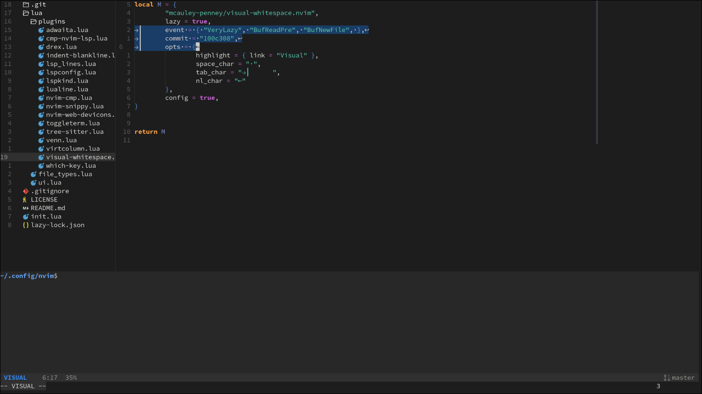

# Neovim Configuration

This repository contains my personal Neovim configuration. It primarily targets
Linux, but also has some support for Unix-like systems including MinGW.

## Usage
My configuration does not contain an excessive amount of keybinds, but includes
[which-key](https://github.com/folke/which-key.nvim) regardless. Some stuff is available behind the `+` key.

## Dependencies
Void: `xbps-install neovim clang-tools-extra lua-language-server`

- neovim
- clangd
- lua-language-server

